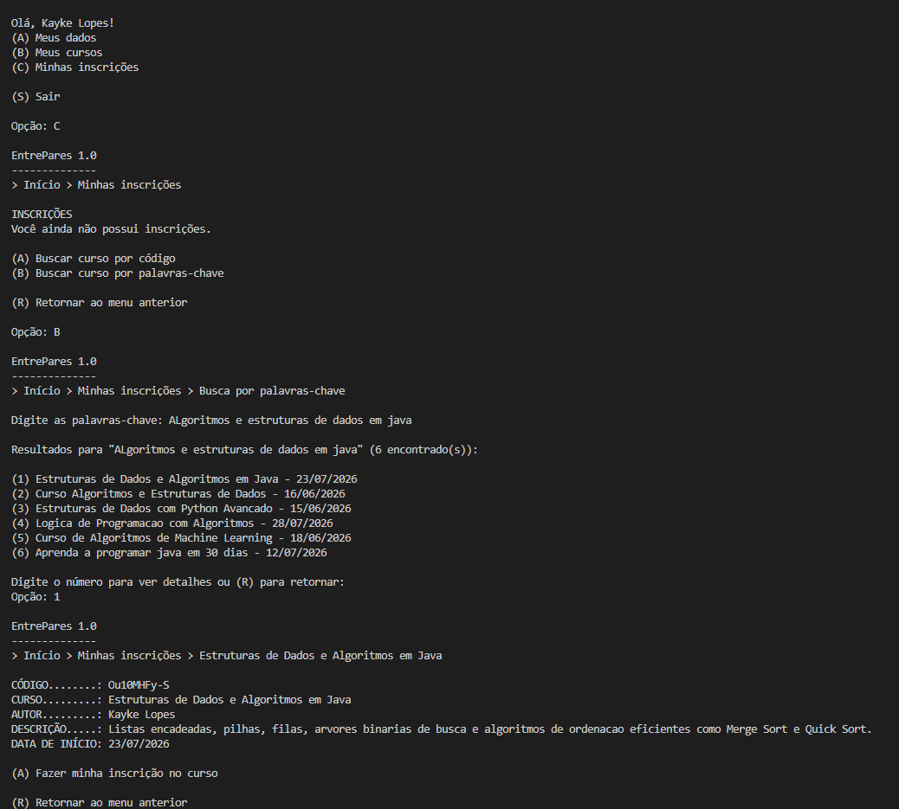

# Relatório do Trabalho Prático — AEDS 3
### Sistema EntrePares 1.0

---

## Participantes

| # | Nome |
|---|------|
| 1 | Guilherme Almeida Zuim |
| 2 | Vitor Luís Lobo Barbosa |
| 3 | Júlia Santos do Carmo |
| 4 | João Paulo de Deus Natividade Oliveira Saraiva |

---

## Descrição do Sistema

O sistema implementa um gerenciador de usuários e cursos para o projeto **EntrePares 1.0**, desenvolvido como trabalho prático da disciplina de Algoritmos e Estruturas de Dados III. Trata-se de uma aplicação em Java que oferece as seguintes funcionalidades:

- Cadastro e login de usuários com autenticação via e-mail e senha.
- CRUD completo de cursos vinculados a cada usuário.
- Navegação por menus interativos no console.
- Controle de status do curso: **ativo**, **inscrições encerradas**, **concluído** e **cancelado**.
- Geração automática de código NanoID para cada curso criado.
- Inicialização automática de cursos de exemplo para usuários sem cursos cadastrados.
- Exclusão e criação de cursos.
- Inscrição e cancelamento de inscrição em cursos de outros usuários.
- Busca de cursos por código NanoID compartilhável.
- Listagem paginada de todos os cursos do sistema.
- Gestão de inscritos pelo proponente do curso com exportação CSV.
- **Busca de cursos por palavras-chave com ranqueamento TF×IDF via índice invertido.**

---

## Telas do Sistema

---

### TP1 — Cadastro, login e CRUD de cursos

---

#### Tela Inicial — Login e Cadastro

Ao iniciar o sistema, o usuário é apresentado a um menu com as opções de **login** (para usuários já cadastrados) e **cadastro** (para novos usuários). O login é realizado por e-mail e senha, com validação via índice hash extensível.


---

#### Menu Principal (pós-login)

Após autenticação bem-sucedida, o usuário acessa o menu principal com três opções: **Meus Dados**, **Meus Cursos** e **Minhas Inscrições**.


---

#### Tela Meus Dados

Permite ao usuário visualizar e editar suas informações pessoais (nome e e-mail). As alterações são persistidas no arquivo binário de clientes com atualização do índice hash.


---

#### Tela Meus Cursos e Criação de Curso

Exibe a lista numerada dos cursos cadastrados pelo usuário autenticado, ordenados **alfabeticamente**. Cada item mostra o nome do curso e a data de início. A partir desta tela é possível acessar os detalhes de um curso ou criar um novo.
E também o Formulário de cadastro de um novo curso, onde o usuário informa nome, descrição e data de início. O sistema gera automaticamente um código NanoID único e associa o curso ao usuário autenticado via `idUsuario`.


---

#### Tela de Detalhes do Curso

Apresenta todas as informações de um curso selecionado: **código NanoID**, nome, descrição, data de início e status atual. Disponibiliza as ações: editar curso, encerrar inscrições, concluir curso e cancelar curso.


---

### TP2 — Inscrições e gestão de inscritos

---

#### Busca por NanoID e CRUD de Inscrições (usuário)

Tela onde o usuário insere um código NanoID (que já possui) para localizar um curso de outro usuário, e as telas que demonstram a criação (inscrição), leitura (lista/visualização) e exclusão (cancelamento) de inscrições.


---

#### Lista completa de cursos (paginação 10 em 10)

Tela que exibe a listagem completa de cursos do sistema com paginação de 10 itens por página.


---

#### Visão de Gestão de Inscritos (proponente do curso)

Tela em `MenuCursos → Gerenciar inscritos` onde o proponente do curso pode ver a lista de inscritos e exportar/gerir cada inscrição.


---

### TP3 — Busca por palavras-chave com índice invertido

---

#### Busca por palavras-chave com ranqueamento TF×IDF

Tela acessível em `Minhas Inscrições → (B) Buscar curso por palavras-chave`. O usuário digita um ou mais termos e o sistema retorna os cursos ordenados por relevância calculada via TF×IDF, utilizando o índice invertido persistido em arquivo binário.




---

## Estrutura de Arquivos do Repositório

A estrutura atual do repositório está listada abaixo, incluindo código-fonte, dados persistidos, binários compilados e recursos de imagens.

- .gitattributes
- LICENSE
- README.md
- bin/
  - src/
    - core/
      - ArvoreBMais.class
      - ArvoreBMais$Pagina.class
      - NanoId.class
      - Principal.class
      - RegistroArvoreBMais.class
    - cursos/
      - ArquivoCurso.class
      - Curso.class
      - IndiceInvertidoCursos.class
      - IndiceInvertidoCursos$ResultadoBusca.class
      - MenuCursos.class
      - ParUsuarioCurso.class
    - infraestrutura/
      - ArquivoIndexado.class
      - ElementoLista.class
      - HashExtensivel.class
      - HashExtensivel$Cesto.class
      - HashExtensivel$Diretorio.class
      - ListaInvertida.class
      - ListaInvertida$Bloco.class
      - ParIdEndereco.class
      - RegistroHashExtensivel.class
      - RegistroPersistente.class
    - inscricoes/
      - ArquivoInscricao.class
      - Inscricao.class
      - MenuInscricoes.class
      - ParIntInt.class
    - usuarios/
      - ArquivoUsuario.class
      - MenuUsuarios.class
      - ParEmailId.class
      - Usuario.class
- dados/
  - clientes/
    - clientes.c.db
    - clientes.d.db
    - clientes.db
    - indiceEmail.c.db
    - indiceEmail.d.db
  - cursos/
    - cursos.c.db
    - cursos.d.db
    - cursos.db
    - relacao.b.db
  - cursoUsuario/
    - cursoInscricao.b.db
    - cursoUsuario.b.db
    - cursoUsuario.c.db
    - cursoUsuario.d.db
    - usuarioInscricao.b.db
  - indiceinvertido/
    - dicionario.li.db
    - blocos.li.db
- Imagens/
  - image1.png
  - image2.png
  - image3.png
  - image4.png
  - image5.png
  - image6.png
  - image7.png
  - image8.png
  - image9.png
  - image10.png _(placeholder TP3 — adicionar screenshot real)_
- src/
  - core/
    - ArvoreBMais.java
    - NanoId.java
    - Principal.java
    - RegistroArvoreBMais.java
  - cursos/
    - ArquivoCurso.java
    - Curso.java
    - IndiceInvertidoCursos.java
    - MenuCursos.java
    - ParUsuarioCurso.java
  - infraestrutura/
    - ArquivoIndexado.java
    - ElementoLista.java
    - HashExtensivel.java
    - ListaInvertida.java
    - ParIdEndereco.java
    - RegistroHashExtensivel.java
    - RegistroPersistente.java
  - inscricoes/
    - ArquivoInscricao.java
    - Inscricao.java
    - MenuInscricoes.java
    - ParIntInt.java
  - usuarios/
    - ArquivoUsuario.java
    - MenuUsuarios.java
    - ParEmailId.java
    - Usuario.java

---

## Classes Criadas

### TP1
- `src.core.ArvoreBMais`
- `src.core.NanoId`
- `src.core.Principal`
- `src.core.RegistroArvoreBMais`
- `src.cursos.ArquivoCurso`
- `src.cursos.Curso`
- `src.cursos.MenuCursos`
- `src.cursos.ParUsuarioCurso`
- `src.infraestrutura.ArquivoIndexado`
- `src.infraestrutura.HashExtensivel`
- `src.infraestrutura.ParIdEndereco`
- `src.infraestrutura.RegistroHashExtensivel`
- `src.infraestrutura.RegistroPersistente`
- `src.usuarios.ArquivoUsuario`
- `src.usuarios.MenuUsuarios`
- `src.usuarios.ParEmailId`
- `src.usuarios.Usuario`

### TP2
- `src.inscricoes.ArquivoInscricao`
- `src.inscricoes.Inscricao`
- `src.inscricoes.MenuInscricoes`
- `src.inscricoes.ParIntInt`

### TP3
- `src.infraestrutura.ElementoLista`
- `src.infraestrutura.ListaInvertida`
- `src.cursos.IndiceInvertidoCursos`

---

## Estrutura do Projeto Atual

O código está organizado em cinco pacotes dentro da pasta `src`: `src.core`, `src.usuarios`, `src.cursos`, `src.inscricoes` e `src.infraestrutura`. O diretório `bin` contém os arquivos compilados.

---

## Implementação do TP1

### O acesso ao sistema
- Tela de login por e-mail e senha.
- Cadastro de novo usuário com validação de e-mail único.
- Recuperação de senha por pergunta secreta.
- Busca de usuário por e-mail usando índice direto em `HashExtensivel`.

### A entidade Usuário
- Campos implementados: `id`, `nome`, `email`, `senha`, `perguntaSecreta`, `respostaSecreta`.
- O ID é sequencial e serve como identificador único interno.
- O e-mail é usado como chave de busca principal.
- A senha é armazenada como `hashCode()` na criação/alteração.

### A entidade Curso
- Cada curso pertence a um único usuário (`idUsuario`).
- Um usuário pode ter vários cursos (relação 1:N).
- Campos implementados: `id`, `nome`, `descricao`, `dataInicio`, `codigoNanoID`, `estado`, `idUsuario`.
- `codigoNanoID` é gerado automaticamente via `NanoId.generate()` e é distinto do ID interno.
- Estados implementados: `0` (ativo com inscrições abertas), `1` (inscrições encerradas), `2` (realizado), `3` (cancelado).

### Funcionalidades de TP1 implementadas
- Cadastro, login, alteração e exclusão de usuário.
- Recuperação de senha via pergunta secreta.
- CRUD de cursos com criação, leitura, atualização e exclusão.
- Listagem de cursos por usuário, ordenada alfabeticamente.
- Gestão de estado de curso: encerrar inscrições, concluir e cancelar.
- Relacionamento 1:N entre usuário e curso usando `ArvoreBMais<ParUsuarioCurso>`.

---

## Implementação do TP2

### Busca e inscrições
- Menu de inscrições com listagem das inscrições do usuário ativo.
- Busca por curso usando código NanoID.
- Listagem de todos os cursos com paginação de 10 itens por página.
- Inscrição em curso aberto e cancelamento de inscrição pelo usuário.

### Relacionamento N:N e persistência
- A entidade `Inscricao` representa a associação entre usuário e curso.
- `ArquivoInscricao` mantém os registros de inscrição.
- Duas árvores B+ suportam o relacionamento N:N:
  - `arvoreUsuarioInscricao` para (idUsuario, idInscricao).
  - `arvoreCursoInscricao` para (idCurso, idInscricao).
- A implementação permite consultar cursos de um usuário e inscritos de um curso.

### Gestão de inscritos
- `MenuCursos` permite visualizar inscritos em um curso criado pelo usuário.
- Exporta a lista de inscritos para CSV.
- Permite cancelar inscrição de um usuário inscrito.

---

## Implementação do TP3

### Índice invertido com TF×IDF

O TP3 implementa a busca de cursos por palavras-chave usando um **índice invertido** com pontuação **TF×IDF** (*Term Frequency × Inverse Document Frequency*).

#### Fluxo de indexação

1. Ao criar um curso, o nome é tokenizado: dividido em palavras, convertidas para minúsculas e sem acentos (normalização Unicode NFD), e filtradas por uma lista de *stop words* em português.
2. Para cada termo válido, calcula-se o **TF** = ocorrências do termo / total de termos válidos no nome.
3. O par `(idCurso, TF)` é inserido na lista invertida do termo via `ListaInvertida.create()`.
4. Ao deletar ou renomear um curso, as entradas correspondentes são removidas ou atualizadas automaticamente.
5. Na primeira execução após a instalação do TP3, o sistema detecta que o índice está vazio e **reindexará automaticamente todos os cursos existentes**.

#### Fluxo de busca

1. A consulta do usuário passa pelo mesmo pipeline de normalização e remoção de *stop words*.
2. Para cada termo da consulta, recupera-se a lista de pares `(idCurso, TF)`.
3. Calcula-se o **IDF** = log₁₀(N / df) + 1, onde N é o total de cursos e df é o número de cursos que contêm o termo.
4. Multiplica-se TF × IDF para cada par e soma-se os valores de cursos com IDs repetidos entre termos.
5. A lista final é ordenada pela pontuação em ordem decrescente e exibida ao usuário.

#### Classes criadas no TP3

| Classe | Pacote | Descrição |
|--------|--------|-----------|
| `ElementoLista` | `src.infraestrutura` | Par `(id, frequência)` armazenado nas listas invertidas. Implementa `Comparable` e `Cloneable`. |
| `ListaInvertida` | `src.infraestrutura` | Estrutura de dados completa do índice invertido com dicionário e blocos encadeados em arquivo. Fornece `create`, `read`, `update`, `delete`, `incrementaEntidades` e `decrementaEntidades`. |
| `IndiceInvertidoCursos` | `src.cursos` | Camada de negócio que une `ListaInvertida` ao domínio de cursos. Gerencia normalização de texto, *stop words*, cálculo TF×IDF e coordena criação/atualização/remoção de índices. Define também a classe interna `ResultadoBusca`. |

#### Classes modificadas no TP3

| Classe | Mudança |
|--------|---------|
| `ArquivoCurso` | Instancia `IndiceInvertidoCursos` e chama `indexarCurso`, `removerCurso` e `atualizarCurso` nos métodos `create`, `delete` e `update`. Inclui reindexação automática de cursos pré-existentes. Expõe o novo método `buscarPorPalavras(String consulta)`. |
| `MenuInscricoes` | A opção (B) "Buscar curso por palavras-chave" agora executa a busca TF×IDF e exibe os resultados ordenados por relevância, permitindo acessar os detalhes de cada curso encontrado. |

#### Arquivos de dados gerados

```
dados/
  indiceinvertido/
    dicionario.li.db   ← cabeçalho (nº de entidades) + pares (termo, endereço)
    blocos.li.db       ← blocos encadeados com os ElementoLista de cada termo
```

---

## Principais classes do projeto

| Classe | TP | Descrição |
|--------|----|-----------|
| `src.core.Principal` | TP1 | Ponto de entrada. Exibe o menu principal e abre as telas de usuários, cursos e inscrições. |
| `src.usuarios.MenuUsuarios` | TP1 | Controle e visão de login, cadastro, edição, exclusão e recuperação de senha. |
| `src.usuarios.ArquivoUsuario` | TP1 | CRUD de usuários com índice hash extensível por e-mail. |
| `src.usuarios.Usuario` | TP1 | Entidade de usuário persistente. |
| `src.usuarios.ParEmailId` | TP1 | Registro de índice por e-mail para `HashExtensivel`. |
| `src.cursos.MenuCursos` | TP1/TP2 | Controle e visão de cursos, com gestão de inscritos e exportação CSV. |
| `src.cursos.ArquivoCurso` | TP1/TP3 | CRUD de cursos com índice 1:N via B+ e integração com índice invertido. |
| `src.cursos.Curso` | TP1 | Entidade de curso persistente com NanoID e estado. |
| `src.cursos.ParUsuarioCurso` | TP1 | Par `(idUsuario, idCurso)` usado na árvore B+. |
| `src.cursos.IndiceInvertidoCursos` | TP3 | Gerencia indexação e busca TF×IDF. Define `ResultadoBusca`. |
| `src.inscricoes.MenuInscricoes` | TP2/TP3 | Controle e visão de inscrições, busca por código, listagem, busca por palavras-chave e cancelamento. |
| `src.inscricoes.ArquivoInscricao` | TP2 | CRUD de inscrições com dois índices B+ de apoio. |
| `src.inscricoes.Inscricao` | TP2 | Entidade de inscrição entre usuário e curso. |
| `src.inscricoes.ParIntInt` | TP2 | Par `(id1, id2)` usado nas árvores B+ de inscrição. |
| `src.core.ArvoreBMais` | TP1 | Implementação genérica de árvore B+. |
| `src.core.NanoId` | TP1 | Gerador de código NanoID. |
| `src.infraestrutura.ArquivoIndexado` | TP1 | Armazenamento genérico persistente com índice direto. |
| `src.infraestrutura.HashExtensivel` | TP1 | Índice hash extensível para buscas por valor direto. |
| `src.infraestrutura.RegistroPersistente` | TP1 | Interface base para registros persistentes. |
| `src.infraestrutura.RegistroHashExtensivel` | TP1 | Interface para registros de índice hash. |
| `src.infraestrutura.ParIdEndereco` | TP1 | Par `(id, endereco)` usado pelo índice hash. |
| `src.infraestrutura.ElementoLista` | TP3 | Par `(id, frequência)` das listas invertidas. |
| `src.infraestrutura.ListaInvertida` | TP3 | Índice invertido persistido em arquivo com blocos encadeados. |

---

## Respostas aos questionários

---

### Checklist TP1

- [x] **Há um CRUD de usuários (que estende a classe `ArquivoIndexado`, acrescentando Tabelas Hash Extensíveis e Árvores B+ como índices diretos e indiretos conforme necessidade) que funciona corretamente?**
  - ✅ Sim. `ArquivoUsuario` estende `ArquivoIndexado` e usa `HashExtensivel` como índice direto por e-mail, permitindo cadastro, login, alteração, exclusão e recuperação de senha.

- [x] **Há um CRUD de cursos (que estende a classe `ArquivoIndexado`, acrescentando Tabelas Hash Extensíveis e Árvores B+ como índices diretos e indiretos conforme necessidade) que funciona corretamente?**
  - ✅ Sim. `ArquivoCurso` estende `ArquivoIndexado` e utiliza `ArvoreBMais<ParUsuarioCurso>` como índice indireto para o relacionamento 1:N com usuários.

- [x] **Os cursos estão vinculados aos usuários usando o `idUsuario` como chave estrangeira?**
  - ✅ Sim. Cada instância de `Curso` armazena o campo `idUsuario`, usado tanto para persistência quanto para consultas no índice B+.

- [x] **Há uma árvore B+ que registre o relacionamento 1:N entre usuários e cursos?**
  - ✅ Sim. `ArquivoCurso` mantém uma `ArvoreBMais<ParUsuarioCurso>` que registra os pares `(idUsuario, idCurso)`, permitindo recuperar todos os cursos de um usuário.

- [x] **Há um CRUD de usuários (que estende a classe `ArquivoIndexado`, acrescentando Tabelas Hash Extensíveis e Árvores B+ como índices diretos e indiretos conforme necessidade)?**
  - ✅ Sim. Idem ao primeiro item — `ArquivoUsuario` estende `ArquivoIndexado` com `HashExtensivel` por e-mail.

- [x] **O trabalho compila corretamente?**
  - ✅ Sim. O projeto compila sem erros. Há apenas um aviso de API obsoleta pré-existente em `MenuInscricoes.java`.

- [x] **O trabalho está completo e funcionando sem erros de execução?**
  - ✅ Sim. Todas as funcionalidades do TP1 estão implementadas e funcionando corretamente.

- [x] **O trabalho é original e não a cópia de um trabalho de outro grupo?**
  - ✅ Sim. O código foi desenvolvido integralmente pelo grupo.

---

### Checklist TP2

- [x] **Há um CRUD da entidade de associação CursoUsuario (que estende a classe `ArquivoIndexado`, acrescentando Tabelas Hash Extensíveis e Árvores B+ como índices diretos e indiretos conforme necessidade) que funciona corretamente?**
  - ✅ Sim. `ArquivoInscricao` estende `ArquivoIndexado` e mantém duas árvores B+: `arvoreUsuarioInscricao` (idUsuario → idInscricao) e `arvoreCursoInscricao` (idCurso → idInscricao), suportando o relacionamento N:N entre usuários e cursos.

- [x] **A visão de inscrições está corretamente implementada e permite consultas aos cursos em que um usuário está inscrito?**
  - ✅ Sim. `MenuInscricoes` exibe a lista de inscrições do usuário autenticado, recuperadas via `ArquivoInscricao.readByUsuario()`, com nome do curso e data de início.

- [x] **A visão de cursos funciona corretamente e permite a gestão dos usuários inscritos em um curso?**
  - ✅ Sim. `MenuCursos` oferece a opção "Gerenciar inscritos", que lista todos os inscritos em um curso do usuário autenticado, permite cancelar inscrições individualmente e exportar a lista para CSV.

- [x] **Há uma visualização dos cursos de outras pessoas por meio de um código NanoID?**
  - ✅ Sim. A opção (A) "Buscar curso por código" em `MenuInscricoes` utiliza `ArquivoCurso.readByCodigo()` para localizar qualquer curso pelo seu código NanoID compartilhável.

- [x] **A integridade do relacionamento entre cursos e usuários está mantida em todas as operações?**
  - ✅ Sim. Ao deletar um curso, todas as inscrições associadas são removidas. Ao deletar um usuário, seus cursos e inscrições são excluídos. Os índices B+ são atualizados em todas as operações de criação e exclusão.

- [x] **O trabalho compila corretamente?**
  - ✅ Sim. O projeto compila sem erros.

- [x] **O trabalho está completo e funcionando sem erros de execução?**
  - ✅ Sim. Todas as funcionalidades do TP2 estão implementadas e funcionando corretamente.

- [x] **O trabalho é original e não a cópia de um trabalho de outro grupo?**
  - ✅ Sim. O código foi desenvolvido integralmente pelo grupo.

---

### Checklist TP3

- [x] **O índice invertido com os termos dos nomes dos cursos foi criado usando a classe `ListaInvertida`?**
  - ✅ Sim. A classe `ListaInvertida` (pacote `src.infraestrutura`) é o núcleo da estrutura. `IndiceInvertidoCursos` a instancia e utiliza para persistir e recuperar os pares `(idCurso, TF)` de cada termo indexado.

- [x] **É possível buscar cursos por palavras no menu de inscrição?**
  - ✅ Sim. A opção (B) "Buscar curso por palavras-chave" em `MenuInscricoes` chama `ArquivoCurso.buscarPorPalavras()`, que executa o cálculo TF×IDF e retorna os cursos ordenados por relevância.

- [x] **O trabalho compila corretamente?**
  - ✅ Sim. O projeto compila sem erros. Há apenas um aviso de API obsoleta pré-existente em `MenuInscricoes.java`.

- [x] **O trabalho está completo e funcionando sem erros de execução?**
  - ✅ Sim. Todas as funcionalidades do TP3 estão implementadas e funcionando, incluindo reindexação automática de cursos pré-existentes na primeira execução.

- [x] **O trabalho é original e não a cópia de um trabalho de outro grupo?**
  - ✅ Sim. O código foi desenvolvido integralmente pelo grupo.

---

## Como Executar

No Windows PowerShell, navegue até a raiz do projeto `AEDS3` e execute:

**1. Compilar:**
```powershell
cd "c:\Users\ramle\Nova pasta\AEDS3"
javac -d .\bin $(Get-ChildItem -Path .\src -Recurse -Filter *.java | ForEach-Object { '"' + $_.FullName + '"' })
```

**2. Executar:**
```powershell
java -cp .\bin src.core.Principal
```

---

**Observação:** o diretório de saída é `bin`, e o código-fonte está em `src`.

**LINK VIDEO DE TESTE DO PROGRAMA TP1 :** https://youtu.be/u4ZRTKo4rf4

**LINK VIDEO DE TESTE DO PROGRAMA TP2 :** https://youtu.be/wVEOqWgfq9M

**LINK VIDEO DE TESTE DO PROGRAMA TP3 :** https://youtu.be/I-WvNRbNtbk
