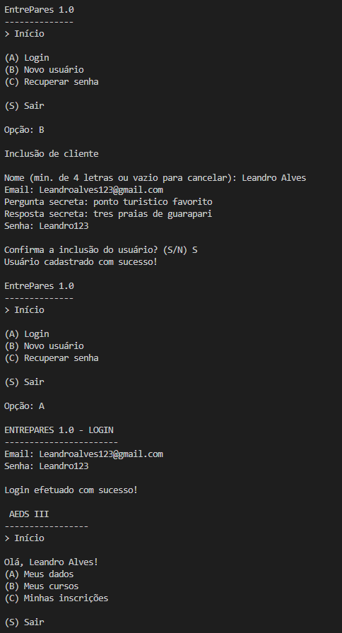
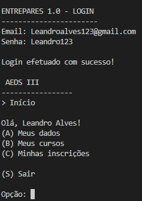
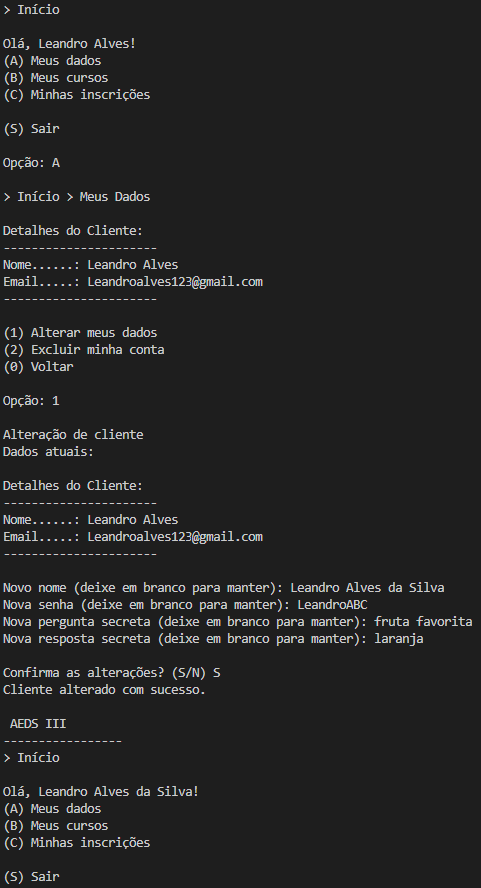
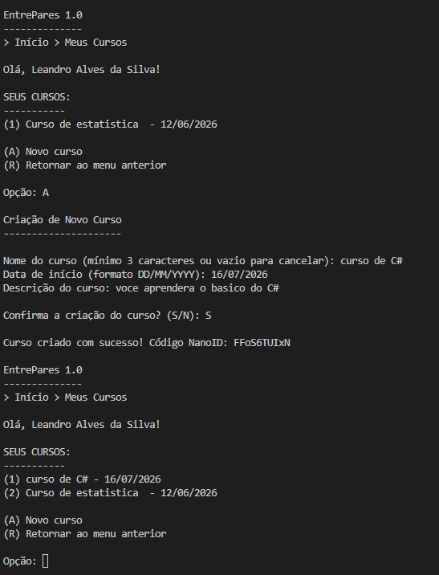
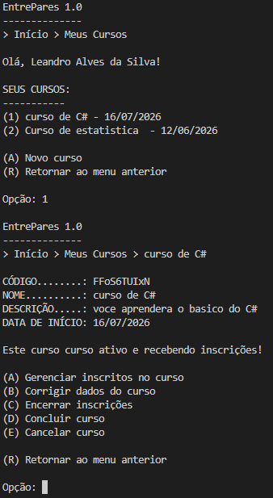
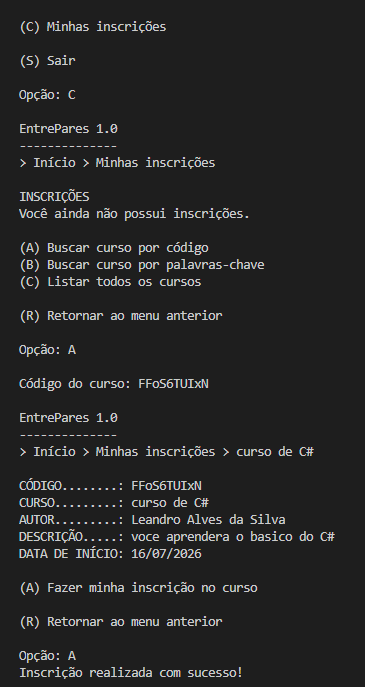
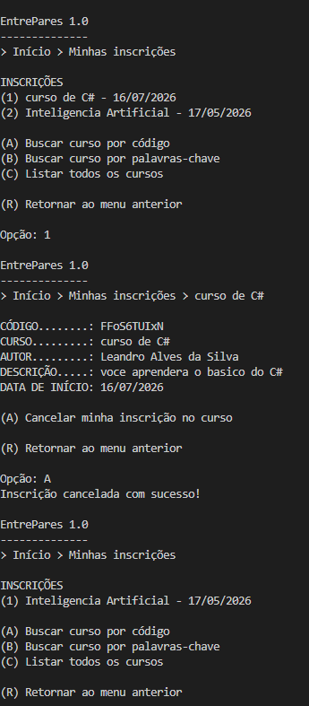
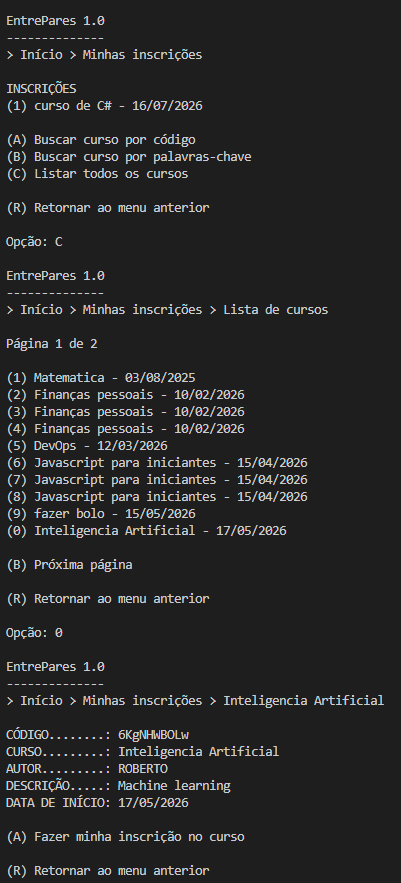
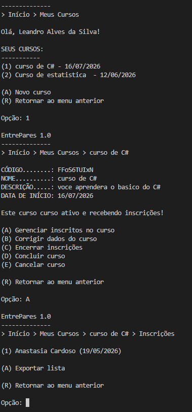

# Relatório do Trabalho Prático — AEDS 3
### Sistema EntrePares 1.0

---

## Participantes

| # | Nome |
|---|------|
| 1 | Guilherme Almeida Zuim |
| 2 | Vitor Luís Lobo Barbosa |
| 3 | Júlia Santos do Carmo |
| 4 | João Paulo de Deus Natividade Oliveira Saraiva |

---

## Descrição do Sistema

O sistema implementa um gerenciador de usuários e cursos para o projeto **EntrePares 1.0**, desenvolvido como trabalho prático da disciplina de Algoritmos e Estruturas de Dados III. Trata-se de uma aplicação em Java que oferece as seguintes funcionalidades:

- Cadastro e login de usuários com autenticação via e-mail e senha.
- CRUD completo de cursos vinculados a cada usuário.
- Navegação por menus interativos no console.
- Controle de status do curso: **ativo**, **inscrições encerradas**, **concluído** e **cancelado**.
- Geração automática de código NanoID para cada curso criado.
- Inicialização automática de cursos de exemplo para usuários sem cursos cadastrados.
- Exclusão e criação de cursos.

---

## Telas do Sistema

### TP1 — Telas principais

### Tela Inicial — Login e Cadastro

Ao iniciar o sistema, o usuário é apresentado a um menu com as opções de **login** (para usuários já cadastrados) e **cadastro** (para novos usuários). O login é realizado por e-mail e senha, com validação via índice hash extensível.




---

### Menu Principal (pós-login)

Após autenticação bem-sucedida, o usuário acessa o menu principal com três opções: **Meus Dados**, **Meus Cursos** e **Minhas Inscrições**.




---

### Tela Meus Dados

Permite ao usuário visualizar e editar suas informações pessoais (nome e e-mail). As alterações são persistidas no arquivo binário de clientes com atualização do índice hash.




---

### Tela Meus Cursos e Criação de Curso

Exibe a lista numerada dos cursos cadastrados pelo usuário autenticado, ordenados **alfabeticamente**. Cada item mostra o nome do curso e a data de início. A partir desta tela é possível acessar os detalhes de um curso ou criar um novo.
E também o Formulário de cadastro de um novo curso, onde o usuário informa nome, descrição e data de início. O sistema gera automaticamente um código NanoID único e associa o curso ao usuário autenticado via `idUsuario`.




---

### Tela de Detalhes do Curso

Apresenta todas as informações de um curso selecionado: **código NanoID**, nome, descrição, data de início e status atual. Disponibiliza as ações: editar curso, encerrar inscrições, concluir curso e cancelar curso.




---

### TP2 — Telas de inscrições e gestão de inscritos

Para facilitar a correção, capturem e coloquem as imagens reais nos caminhos sugeridos abaixo.

- **Busca por NanoID e CRUD de Inscrições (usuário)**

   - Tela onde o usuário insere um código NanoID (que já possui) para localizar um curso de outro usuário e as telas que demonstram a criação (inscrição), leitura (lista/visualização), e exclusão (cancelamento) de inscrições.

   
   

- **Lista completa de cursos (paginação 10 em 10)**

   - Descrição: Tela que exibe a listagem completa de cursos do sistema com paginação de 10 itens por página.
   

- **Visão de Gestão de Inscritos (proponente do curso)**

   - Tela em `MenuCursos -> Gerenciar inscritos` onde o proponente do curso pode ver a lista de inscritos e exportar/gerir cada inscrição.
   


## Estrutura de Arquivos do Repositório

A estrutura atual do repositório está listada abaixo, incluindo código-fonte, dados persistidos, binários compilados e recursos de imagens.

- .gitattributes
- LICENSE
- README.md
- bin/
  - src/
    - core/
      - ArvoreBMais.class
      - ArvoreBMais$Pagina.class
      - NanoId.class
      - Principal.class
      - RegistroArvoreBMais.class
    - cursos/
      - ArquivoCurso.class
      - Curso.class
      - MenuCursos.class
      - ParUsuarioCurso.class
    - infraestrutura/
      - ArquivoIndexado.class
      - HashExtensivel.class
      - HashExtensivel$Cesto.class
      - HashExtensivel$Diretorio.class
      - ParIdEndereco.class
      - RegistroHashExtensivel.class
      - RegistroPersistente.class
    - inscricoes/
      - ArquivoInscricao.class
      - Inscricao.class
      - MenuInscricoes.class
      - ParIntInt.class
    - usuarios/
      - ArquivoUsuario.class
      - MenuUsuarios.class
      - ParEmailId.class
      - Usuario.class
- dados/
  - clientes/
    - clientes.c.db
    - clientes.d.db
    - clientes.db
    - indiceEmail.c.db
    - indiceEmail.d.db
  - cursos/
    - cursos.c.db
    - cursos.d.db
    - cursos.db
    - relacao.b.db
  - cursoUsuario/
    - cursoInscricao.b.db
    - cursoUsuario.b.db
    - cursoUsuario.c.db
    - cursoUsuario.d.db
    - usuarioInscricao.b.db
- Imagens/
  - image1.png
  - image2.png
  - image3.png
  - image4.png
  - image5.png
  - image6.png
  - image7.png
  - image8.png
  - image9.png
- src/
  - core/
    - ArvoreBMais.java
    - NanoId.java
    - Principal.java
    - RegistroArvoreBMais.java
  - cursos/
    - ArquivoCurso.java
    - Curso.java
    - MenuCursos.java
    - ParUsuarioCurso.java
  - infraestrutura/
    - ArquivoIndexado.java
    - HashExtensivel.java
    - ParIdEndereco.java
    - RegistroHashExtensivel.java
    - RegistroPersistente.java
  - inscricoes/
    - ArquivoInscricao.java
    - Inscricao.java
    - MenuInscricoes.java
    - ParIntInt.java
  - usuarios/
    - ArquivoUsuario.java
    - MenuUsuarios.java
    - ParEmailId.java
    - Usuario.java

## Classes Criadas

- src.core.ArvoreBMais
- src.core.NanoId
- src.core.Principal
- src.core.RegistroArvoreBMais
- src.cursos.ArquivoCurso
- src.cursos.Curso
- src.cursos.MenuCursos
- src.cursos.ParUsuarioCurso
- src.infraestrutura.ArquivoIndexado
- src.infraestrutura.HashExtensivel
- src.infraestrutura.ParIdEndereco
- src.infraestrutura.RegistroHashExtensivel
- src.infraestrutura.RegistroPersistente
- src.inscricoes.ArquivoInscricao
- src.inscricoes.Inscricao
- src.inscricoes.MenuInscricoes
- src.inscricoes.ParIntInt
- src.usuarios.ArquivoUsuario
- src.usuarios.MenuUsuarios
- src.usuarios.ParEmailId
- src.usuarios.Usuario

## Estrutura do Projeto Atual

O código atual está organizado em cinco pacotes dentro da pasta `src`: `src.core`, `src.usuarios`, `src.cursos`, `src.inscricoes` e `src.infraestrutura`. O diretório `bin` contém os arquivos compilados.

## Implementação do TP1

### O acesso ao sistema
- Tela de login por e-mail e senha.
- Cadastro de novo usuário com validação de e-mail único.
- Recuperação de senha por pergunta secreta.
- Busca de usuário por e-mail usando índice direto em `HashExtensivel`.

### A entidade Usuário
- Campos implementados: `id`, `nome`, `email`, `senha`, `perguntaSecreta`, `respostaSecreta`.
- O ID é sequencial e serve como identificador único interno.
- O e-mail é usado como chave de busca principal.
- A senha é armazenada como `hashCode()` na criação/alteração.

### A entidade Curso
- Cada curso pertence a um único usuário (`idUsuario`).
- Um usuário pode ter vários cursos (relação 1:N).
- Campos implementados: `id`, `nome`, `descricao`, `dataInicio`, `codigoNanoID`, `estado`, `idUsuario`.
- `codigoNanoID` é gerado automaticamente via `NanoId.generate()` e é distinto do ID interno.
- Estados implementados: `0` (ativo com inscrições abertas), `1` (inscrições encerradas), `2` (realizado), `3` (cancelado).

### Funcionalidades de TP1 implementadas
- Cadastro, login, alteração e exclusão de usuário.
- Recuperação de senha via pergunta secreta.
- CRUD de cursos com criação, leitura, atualização e exclusão.
- Listagem de cursos por usuário, ordenada alfabeticamente.
- Gestão de estado de curso: encerrar inscrições, concluir e cancelar.
- Relacionamento 1:N entre usuário e curso usando `ArvoreBMais<ParUsuarioCurso>`.

## Implementação do TP2

### Busca e inscrições
- Menu de inscrições com listagem das inscrições do usuário ativo.
- Busca por curso usando código NanoID.
- Listagem de todos os cursos com paginação de 10 itens por página.
- Inscrição em curso aberto e cancelamento de inscrição pelo usuário.
- Busca por palavras-chave ainda não implementada; placeholder para TP3.

### Relacionamento N:N e persistência
- A entidade `Inscricao` representa a associação entre usuário e curso.
- `ArquivoInscricao` mantém os registros de inscrição.
- Duas árvores B+ suportam o relacionamento N:N:
  - `arvoreUsuarioInscricao` para (idUsuario, idInscricao).
  - `arvoreCursoInscricao` para (idCurso, idInscricao).
- A implementação permite consultar cursos de um usuário e inscritos de um curso.

### Gestão de inscritos
- `MenuCursos` permite visualizar inscritos em um curso criado pelo usuário.
- Exporta a lista de inscritos para CSV.
- Permite cancelar inscrição de um usuário inscrito.

## Principais classes atuais

| Classe | Descrição |
|--------|-----------|
| `src.core.Principal` | Ponto de entrada. Exibe o menu principal e abre as telas de usuários, cursos e inscrições. |
| `src.usuarios.MenuUsuarios` | Controle e visão de login, cadastro, edição, exclusão e recuperação de senha. |
| `src.usuarios.ArquivoUsuario` | CRUD de usuários com índice hash extensível por e-mail. |
| `src.usuarios.Usuario` | Entidade de usuário persistente. |
| `src.usuarios.ParEmailId` | Registro de índice por e-mail para `HashExtensivel`. |
| `src.cursos.MenuCursos` | Controle e visão de cursos, com gestão de inscritos e exportação CSV. |
| `src.cursos.ArquivoCurso` | CRUD de cursos com índice 1:N via B+. |
| `src.cursos.Curso` | Entidade de curso persistente com NanoID e estado. |
| `src.cursos.ParUsuarioCurso` | Par `(idUsuario, idCurso)` usado na árvore B+. |
| `src.inscricoes.MenuInscricoes` | Controle e visão de inscrições, busca por código, listagem e cancelamento. |
| `src.inscricoes.ArquivoInscricao` | CRUD de inscrições com dois índices B+ de apoio. |
| `src.inscricoes.Inscricao` | Entidade de inscrição entre usuário e curso. |
| `src.inscricoes.ParIntInt` | Par `(id1, id2)` usado nas árvores B+ de inscrição. |
| `src.core.ArvoreBMais` | Implementação genérica de árvore B+. |
| `src.core.NanoId` | Gerador de código NanoID. |
| `src.infraestrutura.ArquivoIndexado` | Armazenamento genérico persistente com índice direto. |
| `src.infraestrutura.HashExtensivel` | Índice hash extensível para buscas por valor direto. |
| `src.infraestrutura.RegistroPersistente` | Interface base para registros persistentes. |
| `src.infraestrutura.RegistroHashExtensivel` | Interface para registros de índice hash. |
| `src.infraestrutura.ParIdEndereco` | Par `(id, endereco)` usado pelo índice hash. |

---

## Respostas ao questionário

1. **Há um CRUD de usuários que estende `ArquivoIndexado`, acrescentando índices diretos e indiretos conforme necessidade?**
   - ✅ Sim. `ArquivoUsuario` estende `ArquivoIndexado` e usa `HashExtensivel` para índice direto por e-mail.

2. **Há um CRUD de cursos que estende `ArquivoIndexado`, acrescentando índices diretos e indiretos conforme necessidade?**
   - ✅ Sim. `ArquivoCurso` estende `ArquivoIndexado` e usa `ArvoreBMais` para o relacionamento 1:N com usuários.

3. **Os cursos estão vinculados aos usuários usando o `idUsuario` como chave estrangeira?**
   - ✅ Sim. Cada curso armazena `idUsuario`, e o índice B+ mantém a relação com o usuário.

4. **Há uma árvore B+ que registre o relacionamento 1:N entre usuários e cursos?**
   - ✅ Sim. `ParUsuarioCurso` em `ArquivoCurso` registra a relação 1:N em `ArvoreBMais`.

5. **Há um CRUD de usuários que estende `ArquivoIndexado` e usa índices diretos e indiretos?**
   - ✅ Sim. O CRUD de usuários está implementado e permite cadastro, login, alteração, exclusão e recuperação de senha.

6. **O trabalho compila corretamente?**
   - ✅ Sim. O projeto compila com sucesso. Há apenas aviso de API obsoleta em `src/inscricoes/MenuInscricoes.java`.

7. **O trabalho está completo e funcionando sem erros de execução?**
   - ✅ Sim para TP1 e TP2 principais. A única limitação atual é que a busca por palavras-chave ainda não foi implementada.

8. **O trabalho é original e não a cópia de um trabalho de outro grupo?**
   - ✅ Sim. O código é resultado do desenvolvimento do grupo e não de cópia de outro trabalho.

---

## Como Executar

No Windows PowerShell, navegue até a raiz do projeto `AEDS3` e execute:

**1. Compilar:**
```powershell
cd "c:\Users\ramle\Nova pasta\AEDS3"
javac -d .\bin $(Get-ChildItem -Path .\src -Recurse -Filter *.java | ForEach-Object { '"' + $_.FullName + '"' })
```

**2. Executar:**
```powershell
java -cp .\bin src.core.Principal
```

---

**Observação:** o diretório de saída atual é `bin`, e o código-fonte atual está em `src`.


**LINK VIDEO DE TESTE DO PROGRAMA TP1 :** https://youtu.be/u4ZRTKo4rf4
**LINK VIDEO DE TESTE DO PROGRAMA TP2 :** https://youtu.be/wVEOqWgfq9M


